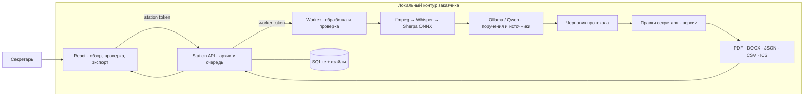

# Meeting Station — протокол совещания, который можно проверить

Локальный помощник секретаря для кейса **Самрук-Казына: автопротоколирование совещаний с фиксацией поручений**. Запись → расшифровка → голоса участников → поручения с источниками → проверка секретарём → PDF/DOCX и структурированный экспорт. Аудио и текст обрабатываются локальными моделями; облачного fallback нет.

Главное изменение для секретаря: можно исправить имя участника, ответственного и срок, подтвердить или отклонить найденное поручение, добавить пропущенное поручение из расшифровки и получить согласованные файлы. Исходные слова и цитаты сохраняются, каждое исправление получает версию и запись в истории. Руководитель видит проверенный список поручений с источниками, а не только автоматически сгенерированное саммари.

[Архитектура](docs/ARCHITECTURE.md) · [Запуск](docs/LOCAL_SETUP.md) · [Локальные модели](docs/MODEL_SETUP.md) · [Требования кейса](docs/REQUIREMENTS.md) · [Проверки и результаты](docs/SUBMISSION_NOTES.md) · [Разработка](docs/DEVELOPMENT.md)

## Архитектура



| Компонент | Ответственность | Где находится |
| --- | --- | --- |
| Интерфейс | Импорт, просмотр источников, правки, скачивание | [`web/frontend/`](web/frontend/) |
| Station API | Авторизация, очередь, хранение записи и готовых версий | [`station/`](station/) |
| Inference worker | Локальное распознавание, диаризация, извлечение, проверка, документы | [`mac-worker/`](mac-worker/) |
| Инструменты разработки | Запуск, диагностика, проверки, сборка исходников | [`scripts/`](scripts/) |
| Контракты и доказательства | Архитектура, требования, воспроизводимость, результаты | [`docs/`](docs/README.md) |

**Этот каталог — корень приложения и harness.** Все команды ниже выполняются здесь;
вложенного репозитория `meeting-intelligence/` больше нет. Существующие appliance-
и native-компоненты сохранены; их роль и границы описаны в архитектуре.

## Быстрый запуск на одном компьютере

Нужны macOS/Linux, Python 3.11+ и Node 22.12+. Базовое приложение проверено на macOS arm64, Python 3.14.6 и Node 24.12.0; для установки пакетов моделей используйте описанное окружение Python 3.12. Модели устанавливаются отдельно. Radxa, Go, Docker и платные API для этого пути не нужны.

```sh
python3 -m venv .venv
.venv/bin/python -m pip install -r requirements/validation.lock
npm --prefix web/frontend ci --ignore-scripts
VITE_MEETING_STATION=true VITE_MEETING_LOCAL=true npm --prefix web/frontend run build
.venv/bin/python scripts/run-local.py init
```

Затем выполните [установку локальных моделей](docs/MODEL_SETUP.md), заполните `.local/single-machine/config.json` и запустите:

```sh
.venv/bin/python scripts/run-local.py doctor
.venv/bin/python scripts/run-local.py start
```

Откройте **http://127.0.0.1:8766/meeting-intelligence**. Введите station-токен из приватного файла `.local/single-machine/tokens.json`; worker-токен остаётся на сервере. На macOS команда `.venv/bin/python scripts/run-local.py token | pbcopy` копирует station-токен без вывода в терминал. Полная инструкция: [LOCAL_SETUP.md](docs/LOCAL_SETUP.md).

Для осмотра интерфейса без моделей допустим явный `start --allow-missing-models`: приложение показывает отсутствующие зависимости, обработка записи не считается работающей. Обычный `start` откажется запускать неполную конфигурацию.

## Основной сценарий

1. Уведомить участников о записи и локальной ИИ-транскрибации. Для проверки использовать смоделированную либо анонимизированную запись.
2. **Import** → аудио/видео MP3, WAV, M4A, WebM, CAF, OGG, FLAC, MP4 или MKV. Выбрать русский, казахский либо смешанный режим; включить **Separate speakers**. Для этого кейса диаризация обязательна.
3. После обработки открыть **Transcript** и прослушать цитируемые фрагменты записи. Диаризация различает голоса, но сама по себе не устанавливает личность.
4. **Review & correct** → сопоставить голоса с именами, исправить владельца/срок/формулировку поручения, явно подтвердить или отклонить выводы. Для пропущенного поручения выбрать **Add missed action**, указать исходную реплику и решение проверяющего. Сохранить имя проверяющего и комментарий.
5. **Export** → Word DOCX, PDF, CSV, JSON или календарные задачи ICS. Сохранённые исправления обновляют все форматы. Отклонённые выводы исключаются из саммари и календаря, но остаются помеченными в полном отчёте.

Относительные сроки не превращаются в выдуманную дату. Секретарь может подтвердить календарную дату вручную; она сохраняется отдельно от сказанной формулировки. ICS — экспорт задач, не сервис автоматической рассылки напоминаний.

## Что изменено относительно предыдущего решения

- Редактирование и восстановление пропущенных поручений из исходных реплик, сопоставление голосов с людьми, постоянная история до/после, защита от перезаписи чужой версии и повторного сохранения при обрыве связи.
- Единый набор PDF/DOCX/JSON/CSV/ICS для каждой версии; публикация после готовности файлов и восстановление архива после прерванной синхронизации.
- Проверка извлечённых фактов видит хронологию обсуждения и оба поля срока, включая более поздние исправления. Неполная проверка не даёт отметку подтверждённого источника.
- Локальный запуск без исходной аппаратной конфигурации, раздельные токены, диагностика зависимостей, зафиксированные базовые зависимости и проверка реального интерфейса.

Это доработка существующего проекта, а не новый алгоритм распознавания или доказанное улучшение «в 100 раз». [Атрибуция](docs/ATTRIBUTION.md) отделяет исходный код и модели от текущих изменений.

## Архитектура и границы

React/Vite → Python station (архив, очередь, API) → Python worker (ffmpeg, Whisper, Sherpa ONNX, Ollama/Qwen) → проверяемый протокол и экспорт. SQLite и файлы; один тяжёлый job за раз. [Архитектура и контракт ревью](docs/ARCHITECTURE.md).

Локальный запуск привязан к loopback. Для отдельной машины worker требует взаимный TLS; браузер не получает его токен. Исторический appliance-путь для захвата Meet/Zoom/Teams сохранён в [RUNBOOK.md](docs/RUNBOOK.md); он требует отдельной инфраструктуры и не входит в проверенный запуск на одном компьютере. Старые `engine/`, `backend/`, Go/Scriberr и Swift-клиент не являются обязательными компонентами этого пути.

Имена проверяющих вводятся пользователями с общим station-токеном: это журнал правок, не индивидуальная аутентификация или неизменяемый аудит. Для промышленной эксплуатации ещё нужны персональные роли, политика хранения/удаления, шифрование диска/резервных копий и проверка на данных заказчика. Промышленное развёртывание и СЭД не входят в обязательную часть кейса.

## Проверки

```sh
.venv/bin/python -m pytest station/tests mac-worker/tests -q
MI_RUN_LOCAL_HTTP_TESTS=1 .venv/bin/python -m pytest station/tests/test_local_http.py -q
VITE_MEETING_STATION=true VITE_MEETING_LOCAL=true npm --prefix web/frontend run build
npm --prefix web/frontend run lint
```

Проверка браузера требует отдельной установки тестового Chromium, но не моделей:

```sh
PLAYWRIGHT_BROWSERS_PATH="$PWD/.local/browsers" web/frontend/node_modules/.bin/playwright install chromium --only-shell
.venv/bin/python scripts/check-ui.py
```

Она создаёт временный архив с явно синтетическим результатом, проходит настоящий интерфейс, сохраняет правки, перезагружает страницу, скачивает DOCX/PDF и проверяет их содержимое. API-ответы в браузере не подменяются. ASR и генерация в этой проверке не выполняются. Результаты, версии, исходные логи, [снимок интерфейса](docs/verification/synthetic-review-desktop.png), примеры документов и оставшиеся ограничения: [SUBMISSION_NOTES.md](docs/SUBMISSION_NOTES.md).

**Не подтверждено в текущем окружении:** точность RU/KZ/смешанной речи, качество голосового разделения, смысловая точность локальной модели, память/скорость полной обработки и работа с полностью отключённой внешней сетью. Для этих утверждений нужны установленные модели и фиксированные записи с человеческой разметкой. Длинные обсуждения за пределами контекста верификатора остаются на ручной проверке.

Для разработки из этого корня доступны `make help`, `make build`, `make check` и
`make verify`. Последняя команда запускает настроенные проверки harness и продукта;
браузерный тест требует установленного тестового Chromium. Рабочие ограничения
и текущая передача задачи: [AGENTS.md](AGENTS.md), [HANDOFF.md](docs/HANDOFF.md).

[Текст кейса и критерии](docs/CHALLENGE.md) · [Покрытие требований](docs/REQUIREMENTS.md) · [Прежнее описание решения](docs/PREVIOUS_README.md) · [MIT license](LICENSE)
