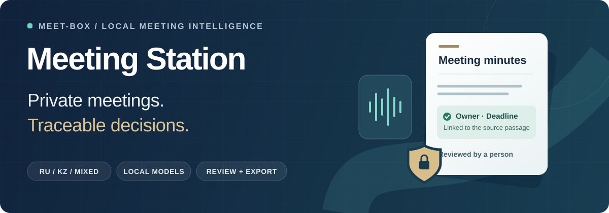
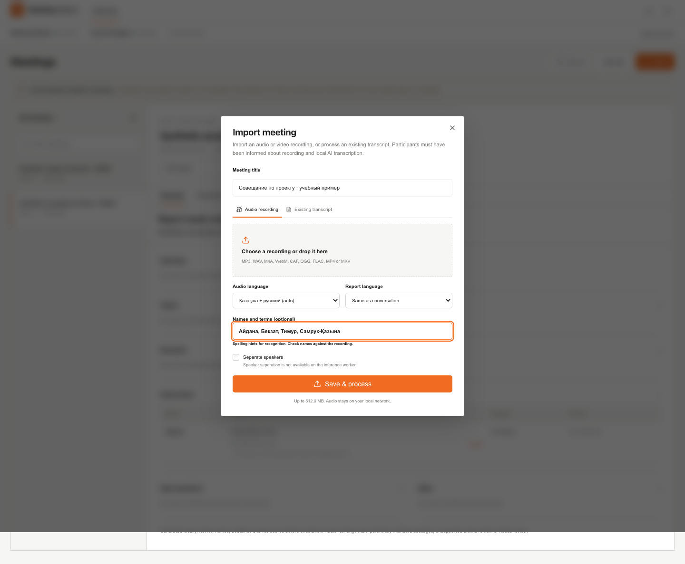
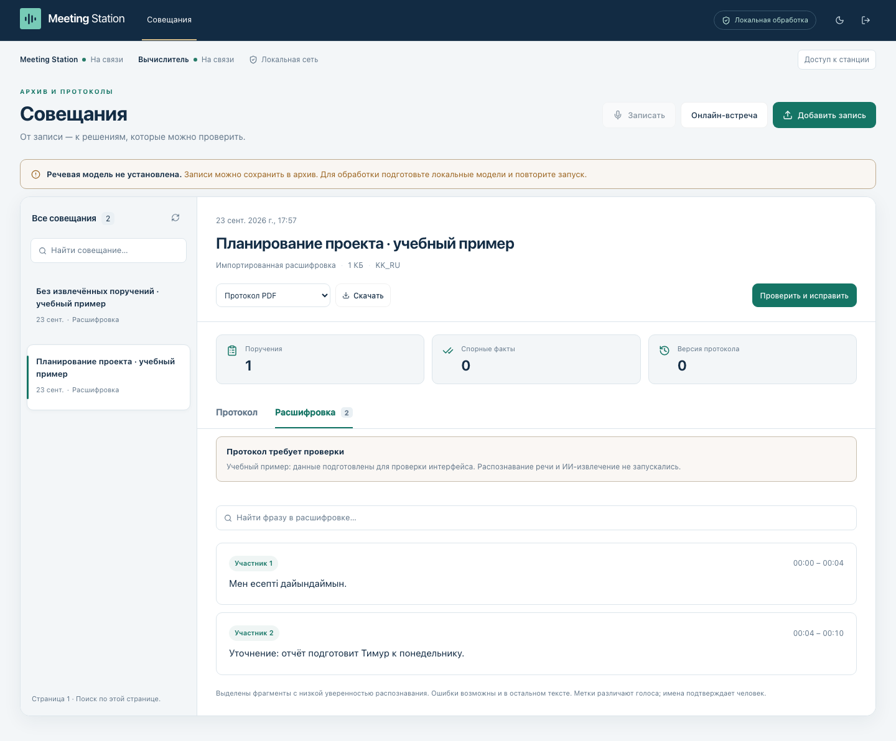
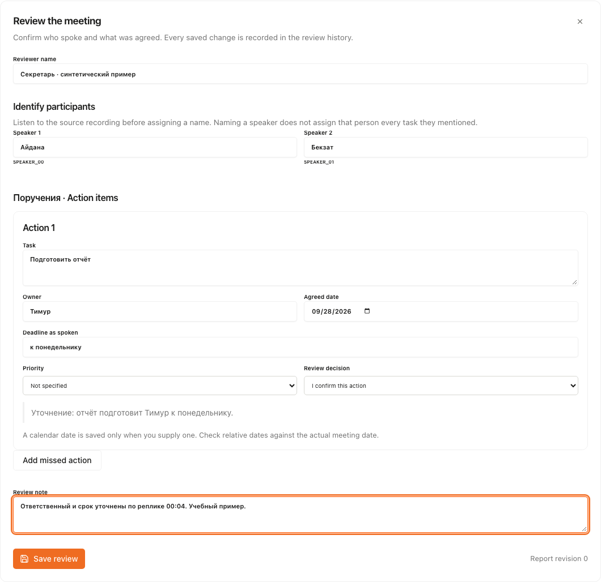
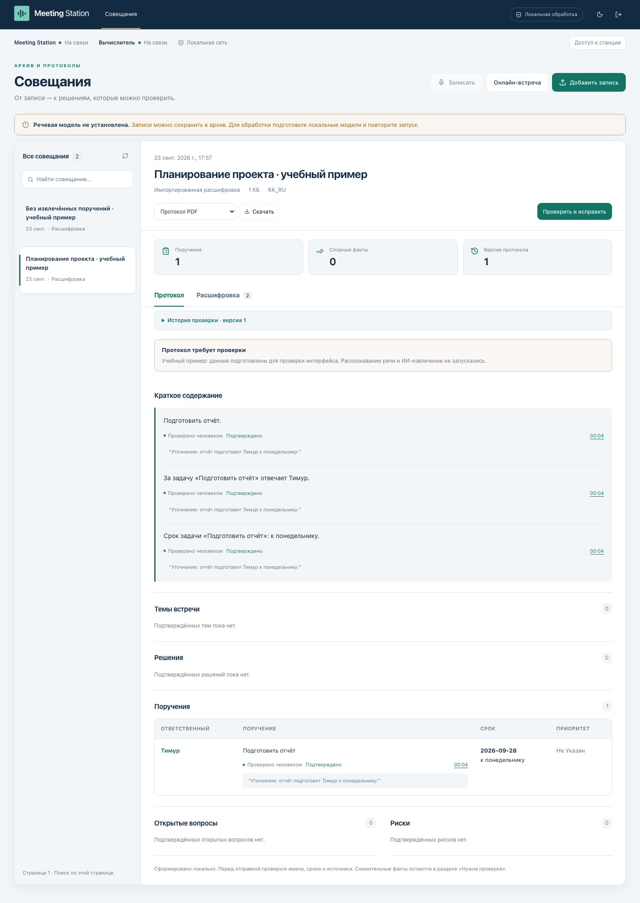
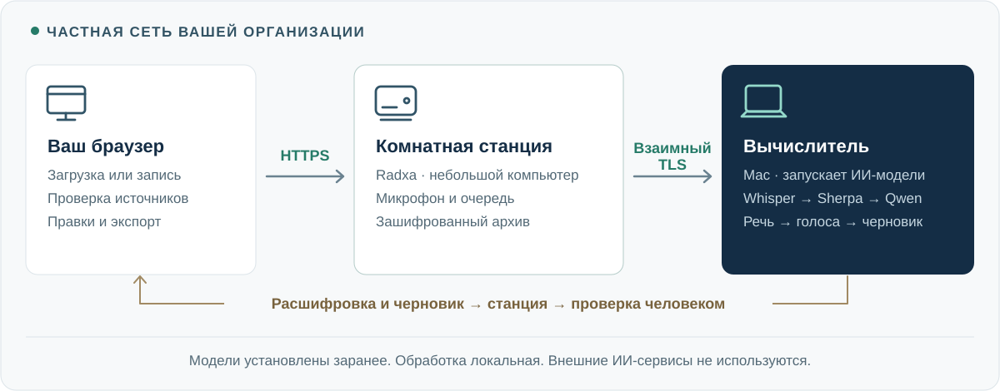
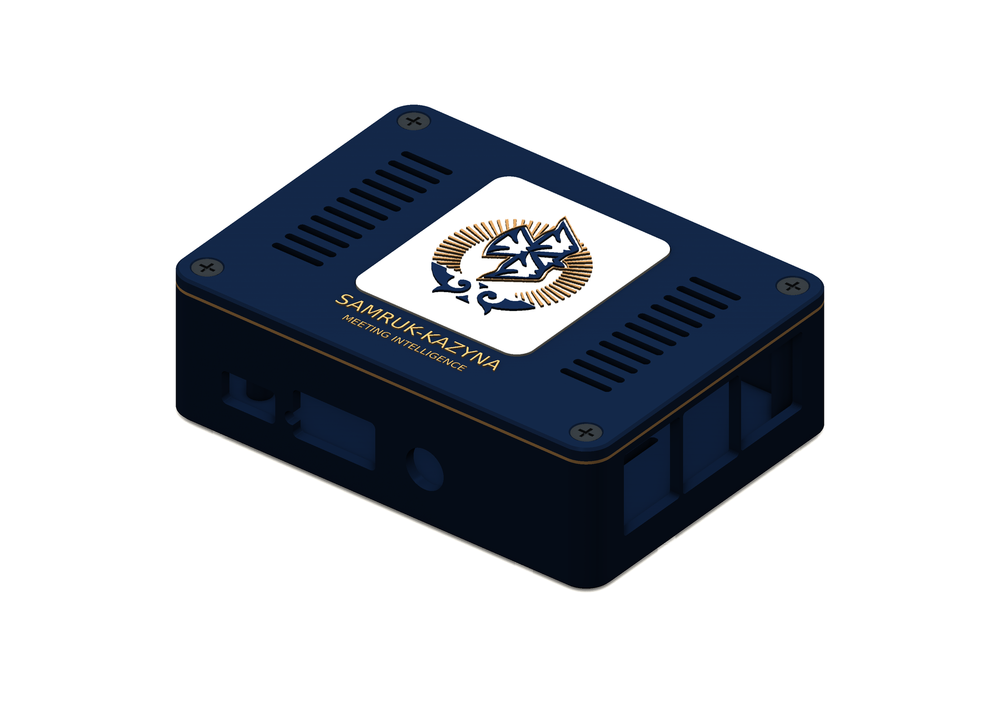
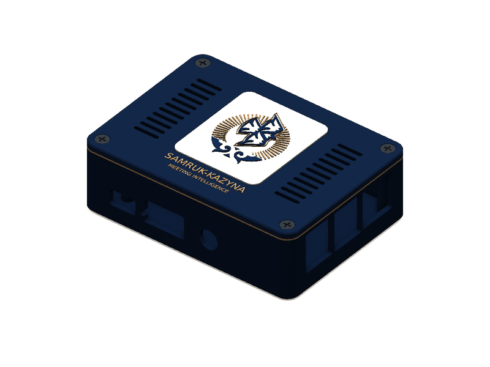
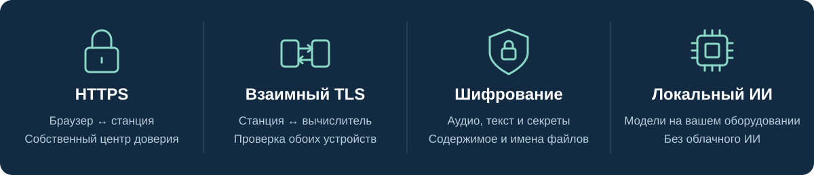

<p align="center">
  
</p>

<p align="center">
  <a href="#как-это-работает">Как это работает</a> ·
  <a href="#безопасность">Безопасность</a> ·
  <a href="#установка">Установка</a> ·
  <a href="#проверки-и-результаты">Результаты проверок</a> ·
  <a href="docs/REQUIREMENTS.md">Требования кейса</a>
</p>

# Meeting Station

**Из записи совещания — в протокол, который можно проверить.** Meeting Station готовит расшифровку, краткое содержание и таблицу поручений. Секретарь открывает исходную реплику, прослушивает аудио, уточняет ответственного и срок, затем сохраняет проверенную версию для выгрузки.

<p align="center">
  <br />
  <sub>Решение кейса Самрук-Казына по автоматизации протоколов совещаний · проект MEET-BOX</sub>
</p>

Пока протокол пишут вручную, поручения легко потерять: срок изменили в конце встречи, ответственного заменили, а в итоговом документе осталось первое решение. [Кейс Самрук-Казына](docs/CHALLENGE.md) добавляет важное условие: распознавать русский, казахский и смешанную речь **без передачи аудио и текста во внешние облачные ИИ-сервисы**.

Мы оставляем запись, модели и проверку на локальном оборудовании. **Секретарь начинает с черновика и его источников, а не восстанавливает всё совещание с нуля.**

## Как это работает

1. **Добавьте запись.** Загрузите аудио или видео либо запишите встречу через микрофон комнатной станции. До начала записи и ИИ-расшифровки уведомите участников.
2. **Получите расшифровку.** Локальная модель Whisper переводит речь в текст. При включённом разделении говорящих Sherpa добавляет метки голосов; секретарь сопоставляет их с людьми.
3. **Откройте черновик.** Локальная модель Qwen выделяет решения, поручения, названных ответственных и сроки. В отчёте также есть краткое содержание, темы, открытые вопросы и риски.
4. **Проверьте источник.** Ссылка у поручения открывает подтверждающую реплику и переводит аудиоплеер к нужному моменту. Исходная расшифровка остаётся доступной.
5. **Уточните результат.** Исправьте поручение, отклоните его или добавьте пропущенное со ссылкой на реплику. Сохраните новую версию с именем проверяющего, временем и комментарием к правкам.
6. **Выгрузите протокол.** Доступны **PDF, DOCX, JSON, CSV и календарный файл задач**. Все форматы используют одни и те же проверенные записи.

Обработка начинается после завершения записи. На комнатной станции также предусмотрен браузер для онлайн-совещаний: подключение зависит от допуска организатором и прав учётной записи. При импорте готового текста распознавание речи и разделение говорящих пропускаются.

### Если поручение изменилось во время встречи

> «Дана отправит отчёт в пятницу».<br />
> Позже: «Отчётом займётся Тимур. Срок — понедельник».

Обработка идёт по порядку реплик и учитывает поздние уточнения. Ожидаемый результат — одно поручение Тимуру со сроком «понедельник». Конкретную календарную дату секретарь подтверждает при проверке источника.

Если ответственного или срока не было, поле остаётся пустым. Локальная модель сверяет извлечённые факты с цитатами и отмечает проблемы или недоступность проверки. Она тоже может ошибиться, поэтому аудио и возможность исправления доступны рядом с результатом.

[Извлечение и проверки](mac-worker/src/meeting_worker/pipeline.py) · [Правила сохранения правок](docs/ARCHITECTURE.md#human-review-contract) · [Поля отчёта](mac-worker/src/meeting_worker/protocol.py)

<details>
<summary><strong>Интерфейс: импорт → расшифровка → проверка → сохранённый протокол</strong></summary>

Снимки настоящего приложения на явно синтетическом примере. При съёмке проверялись локальные запросы, редактирование, сохранение и повторное открытие; речевые и языковые модели не запускались. Нажмите на изображение, чтобы рассмотреть его.

<table>
  <tr>
    <td width="50%"><a href="docs/assets/readme/01-import.png"></a><br /><strong>1. Добавить совещание</strong></td>
    <td width="50%"><a href="docs/assets/readme/02-transcript.png"></a><br /><strong>2. Открыть источник</strong></td>
  </tr>
  <tr>
    <td width="50%"><a href="docs/assets/readme/03-review.png"></a><br /><strong>3. Проверить и исправить</strong></td>
    <td width="50%"><a href="docs/assets/readme/04-reviewed-minutes.png"></a><br /><strong>4. Сохранить и выгрузить</strong></td>
  </tr>
</table>

[Происхождение изображений и запись проверки](docs/assets/readme/README.md)

</details>

## Два устройства в одной локальной сети

**Комнатная станция** — небольшой компьютер, постоянно подключённый к микрофону в переговорной. Он записывает встречу, хранит очередь обработки и архив. Для этой роли мы используем **Radxa Cubie A7A — одноплатный компьютер**.

**Локальный вычислитель** — компьютер, который запускает ресурсоёмкие ИИ-модели. В описанной установке это Mac в той же частной сети. Браузер обращается к станции, станция передаёт запись на Mac и сохраняет полученный отчёт у себя.



| Устройство в описанной установке | За что отвечает |
| --- | --- |
| **Radxa Cubie A7A** · 6 ГБ ОЗУ · Debian 11 | Веб-интерфейс, запись с микрофона, постоянная очередь, архив и браузер для онлайн-совещаний. |
| **MacBook Air M5** · 16 ГБ памяти | Подготовка аудио через FFmpeg, распознавание Whisper, разделение говорящих Sherpa, Qwen3.5 4B и формирование документов. |

**Зачем разделять эти роли?** Запись и доступ к архиву остаются в переговорной, а память и мощность для моделей предоставляет вычислитель. Если Mac временно недоступен, работающая и разблокированная станция сохраняет записи в очереди. После восстановления связи обработка продолжается. Готовые протоколы доступны со станции и без вычислителя.

После перезагрузки станции для автоматического открытия зашифрованного архива нужен включённый Mac с выполненным входом в систему и доступом к локальной сети. Запуск и восстановление описаны в [руководстве эксплуатации](docs/RUNBOOK.md). Для знакомства с приложением можно [запустить обе роли на одном компьютере](docs/LOCAL_SETUP.md), без покупки платы.

<details>
<summary><strong>Комнатная станция: концепт корпуса и вид со всех сторон</strong></summary>

<table>
  <tr>
    <td width="50%"></td>
    <td width="50%"></td>
  </tr>
</table>

Предоставленные участником концепты дизайна. Это не проверенные CAD-модели и не свидетельство испытаний оборудования. [Происхождение иллюстраций](docs/assets/readme/README.md).

</details>

[Архитектура приложения](docs/ARCHITECTURE.md) · [Аппаратная установка](docs/APPLIANCE_ARCHITECTURE.md) · [Сервис станции](station/) · [Вычислитель](mac-worker/)

## Безопасность

**Локальная обработка — только начало. В настроенной аппаратной установке защищены также сетевые соединения и сохранённые данные совещаний.**



- **Браузер → станция: HTTPS.** Собственный центр сертификации подтверждает подлинность станции. Защищённые cookie, ограничения загрузки ресурсов с других источников и запрет кеширования ответов API защищают браузерную сессию.
- **Станция ↔ вычислитель: взаимный TLS.** Оба устройства предъявляют сертификаты; дополнительно используется отдельный токен вычислителя. Станция проверяет центр сертификации и адрес Mac, а Mac требует доверенный клиентский сертификат. Неверные удостоверения отклоняются, перехода на незашифрованный HTTP нет.
- **Архив: шифрование содержимого и имён файлов.** Хранилище gocryptfs защищает записи, расшифровки, документы, базы данных, профиль браузера и секреты доступа. Пока оно заблокировано, сервисы не запускаются. Пароль хранилища не остаётся на плате; в описанной установке диск Mac защищён FileVault.
- **Модели: только локальные.** Ollama принимает запросы на внутреннем адресе Mac. Модели устанавливаются заранее; автоматической отправки во внешний ИИ-сервис нет. Запросы к вычислителю отклоняют публичные адреса, перенаправления и прокси из переменных окружения.

[Защита и восстановление доступа](docs/SECURITY.md) · [Создание сертификатов](scripts/create-worker-pki.py) · [Настройка HTTPS](deploy/radxa/Caddyfile.station.example) · [Защита запуска хранилища](deploy/radxa/unlock-vault.sh)

Это меры аппаратного развёртывания: запуск на одном компьютере использует HTTP только на `127.0.0.1` и сам не создаёт зашифрованное хранилище. Загрузка зависимостей и моделей выполняется при установке; онлайн-совещания подключаются к своему провайдеру. Проверку сертификатов нельзя отключать; сертификаты устройств нужно обновлять до истечения 90 дней.

Шифрование защищает передачу и заблокированный архив. Администратор или вредоносная программа на разблокированном устройстве всё ещё могут получить доступ к данным. Общий токен станции пока не заменяет персональные роли, а история правок не является неизменяемым журналом аудита.

## Установка

Выберите подходящий вариант. Файлы моделей, сертификаты и приватная конфигурация устройств не входят в репозиторий.

| Вариант | Что потребуется | Инструкция |
| --- | --- | --- |
| **Один компьютер** | Python 3.11+, Node 22.12+, FFmpeg, локальные модели речи и разделения голосов, Ollama. Для установки моделей описан путь на Python 3.12. | [Локальный запуск](docs/LOCAL_SETUP.md) |
| **Комнатная станция + Mac** | Те же ресурсы для моделей, подготовленная Radxa, версия Go из `go.mod` и сертификаты устройств. | [Установка станции](docs/STATION_SETUP.md) |

Для первого варианта по инструкции установите зависимости, соберите интерфейс, создайте конфигурацию и подготовьте модели. Затем из корня репозитория:

```sh
.venv/bin/python scripts/run-local.py doctor
.venv/bin/python scripts/run-local.py start
```

Откройте **http://127.0.0.1:8766/meeting-intelligence** и введите созданный токен **станции**. Загрузите запись без чувствительных данных, включите разделение говорящих, проверьте исходные реплики и скачанные PDF/DOCX. О недостающих моделях приложение сообщает явно.

[Подготовка и лицензии моделей](docs/MODEL_SETUP.md) · [Диагностика установки](docs/LOCAL_SETUP.md#checks-and-troubleshooting)

## Проверки и результаты

**23 сентября 2026 года** после исправления технических замечаний получены следующие результаты. [Команды, журналы и хеши файлов](docs/verification/foundations-20260923/README.md) указывают проверенный код и окружение.

| Проверка | Зафиксированный результат |
| --- | --- |
| Тесты станции и вычислителя | **237 пройдено** |
| Проверки ошибок в браузере | **33 пройдено** |
| Полные сценарии проверки и экспорта | **2 пройдено**, включая независимую проверку содержимого PDF/DOCX |
| Сохранённые Python-компоненты / приложение macOS / инструменты разработки | **95 / 16 / 34 пройдено** |
| Сохранённая реализация на Go | Полный набор тестов **с детектором гонок пройден** |
| Интерфейс | Сборки обоих вариантов и статическая проверка пройдены |

Для повторения: `make verify`; для сохранённых компонентов дополнительно — `make verify-go` и `make verify-native` на macOS. Зависимости и тестовый Chromium должны быть уже установлены. Проверки используют синтетические данные и имитацию ответов моделей; качество распознавания языков они не измеряют.

<details>
<summary><strong>Ранее выполненные аппаратные измерения · 11 сентября 2026 года</strong></summary>

| Проверенный сценарий | Результат |
| --- | --- |
| Синтетическая английская запись длительностью 120 секунд → локальная обработка → четыре формата экспорта; HTTPS, взаимный TLS и зашифрованное хранение включены | **62,567 секунды** |
| Перезагрузка Radxa → восстановление сайта, архива, связи с Mac и браузера совещаний | **80,745 секунды**; сохранённый PDF не изменился |
| Отрицательные проверки TLS | Отклонены подключения без сертификата, с недоверенным центром, неверным именем сервера и неподходящим назначением сертификата |

Это результаты предыдущей установки на указанных устройствах, а не новый замер текущих исправлений. Чистая английская запись и один запуск не доказывают точность на русском/казахском или производительность на длинных встречах.

[Журнал аппаратных испытаний](docs/VALIDATION.md) · [Измерения защиты](docs/SECURITY.md#verified-boundaries-and-remaining-limits) · [Оценка распознавания](docs/ACCURACY.md)

</details>

## Что ещё предстоит проверить

Нужны репрезентативные русские, казахские и смешанные записи, включая одновременную речь, а также запуск моделей с физически отключённым интернетом. Метки голосов различают говорящих; имена подтверждает человек. Работа с Google Meet описана в прежнем аппаратном журнале; подключение к реальным Zoom и Teams ещё не подтверждено.

Редактирование, история версий и экспорт PDF/DOCX реализованы. Формальный выпуск протокола, персональные роли, автоматические напоминания, связи поручений между совещаниями и интеграция с СЭД остаются дальнейшими задачами. Календарный экспорт создаёт файл, но не рассылает уведомления.

[Покрытие требований кейса](docs/REQUIREMENTS.md) · [Реестр исправлений 72 замечаний](docs/FOUNDATION_FIXES.md) · [Материалы для оценки](docs/SUBMISSION_NOTES.md)

## Лицензия и авторство

[MIT](LICENSE). Meeting Station использует серверную основу Scriberr и сохраняет её уведомления об авторских правах и лицензию. Станция, локальный вычислитель и процесс проверки описаны в [реестре вклада и заимствований](docs/ATTRIBUTION.md). У моделей и изображений отдельные условия использования. Символика Самрук-Казына обозначает владельца задачи хакатона.

Для обсуждения установки создайте обращение в репозитории: укажите языки совещаний и доступное оборудование. Не публикуйте записи, расшифровки и секреты доступа.
