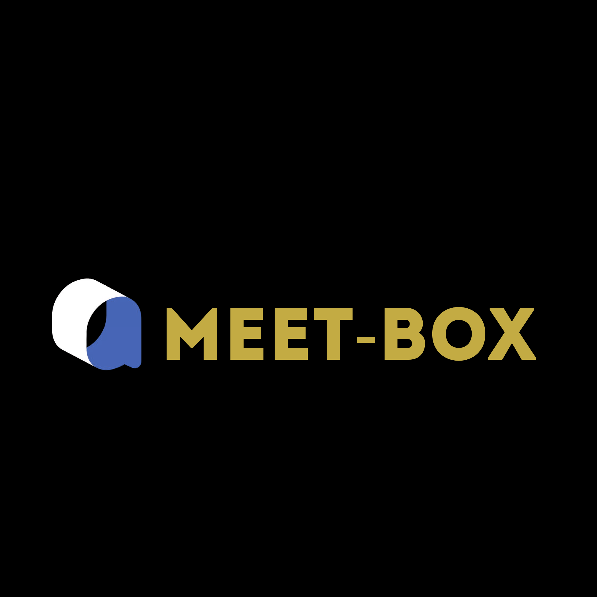
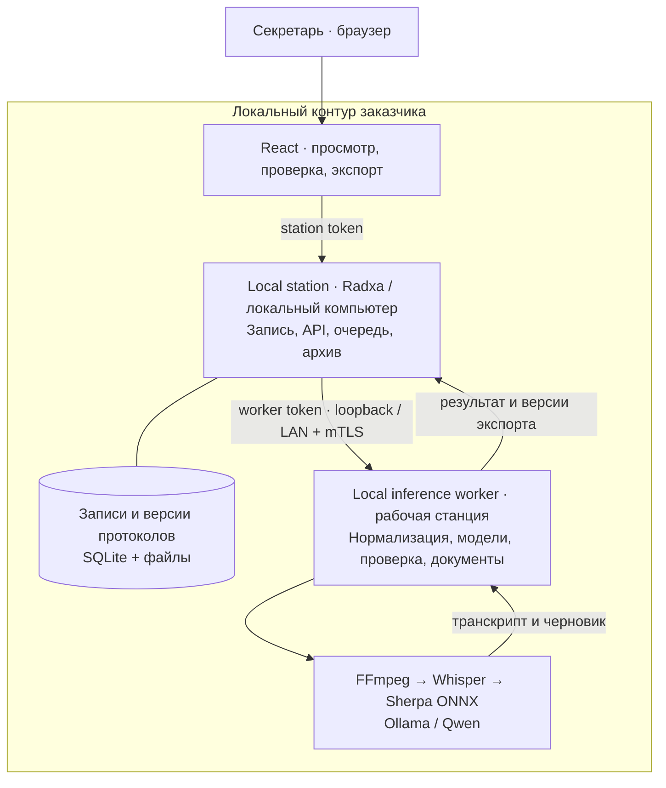

<table>
  <tr>
    <td width="220" align="center">
      
    </td>
    <td>
      <h1>MEET-BOX</h1>
      <p><strong>От записи совещания — к поручениям, которые можно проверить.</strong></p>
      <p>Локальная станция записи и архива + локальный inference worker.<br />Аудио, расшифровка и обработка — внутри контура заказчика.</p>
      <p><strong>Русский · Қазақша · Смешанная речь</strong><br />Источники · Проверка секретарём · Версии · PDF / DOCX</p>
    </td>
  </tr>
</table>

<p align="center">
  <a href="#problem">Проблема</a> ·
  <a href="#workflow">Как работает</a> ·
  <a href="#architecture">Архитектура</a> ·
  <a href="#security">Безопасность</a> ·
  <a href="#value">Почему этот подход</a> ·
  <a href="#start">Запуск</a> ·
  <a href="#evidence">Проверки</a>
</p>

**MEET-BOX помогает секретарю превратить обсуждение в проверяемый протокол:**
найти поручение, сверить его с исходной репликой, уточнить ответственного и срок,
сохранить правку и выгрузить согласованные документы. В текущем интерфейсе
приложение называется **Meeting Station**.

<a id="problem"></a>

## 01 · Проблема: договорённость прозвучала — как сохранить её смысл?


**Кейс Самрук-Казына — «Система автопротоколирования совещаний с фиксацией поручений».**

Секретарь вручную восстанавливает ход обсуждения, участников, решения и сроки.
Во время совещания поручение может сменить владельца, а дата — уточниться.
В итоговом документе легко потерять именно ту версию договорённости, по которой
предстоит работать. Руководителю затем приходится выяснять, кто что обещал.

У задачи есть обязательная граница: **аудио и текст нельзя отправлять во внешние
облачные API**. Нужны локальные модели, русский, казахский и смешанная речь,
различение говорящих, поручения и экспорт протокола.
[Полный текст кейса и критерии](docs/CHALLENGE.md).

**Изменение для пользователя:** секретарь получает черновик с источниками и
инструменты его проверки; руководитель — структурированный список поручений,
в котором можно проследить основание и внесённые правки.

<a id="workflow"></a>

## 02 · Как всё работает — последовательно

**Запись → локальный архив → распознавание → поручения с источниками → проверка → документы.**

| Шаг | Что происходит | Что получает пользователь |
| --- | --- | --- |
| **1. Добавить совещание** | Секретарь уведомляет участников о записи и ИИ-транскрибации. В **Import** загружает аудио/видео и выбирает язык. Запись с микрофона станции и подключение к звонку доступны в отдельной аппаратной конфигурации. | Совещание в локальном архиве и видимый статус обработки. |
| **2. Передать в локальную очередь** | Station сохраняет источник и передаёт задание своему worker. Архив и очередь живут отдельно от процесса распознавания. При недоступности worker предусмотрены отложенная доставка и повторные попытки. | Запись можно хранить на станции, пока вычислитель занят или недоступен. |
| **3. Распознать речь и разделить голоса** | Worker нормализует аудио через FFmpeg, запускает multilingual Whisper и, при включённой диаризации, Sherpa ONNX. Для кейса нужны установленные модели диаризации и **Separate speakers**. | Реплики с временными метками и метками говорящих; имена затем подтверждает человек. |
| **4. Собрать черновик** | Локальная модель через Ollama извлекает темы, решения и поручения. Сервер связывает выводы с репликами; смысловая проверка учитывает хронологию. Непроверенные выводы остаются на ревью. | Поручения с полями «что / кто / когда», саммари и ссылки на источник. |
| **5. Проверить и исправить** | В **Review & correct** секретарь сопоставляет голоса с именами, правит владельца и срок, подтверждает или отклоняет вывод. **Add missed action** позволяет восстановить пропущенное поручение из выбранных реплик. | Явное решение проверяющего, сохранённая исходная цитата и история изменений. |
| **6. Сохранить версию и выгрузить** | Worker создаёт новую версию результата и набор документов; station получает её в свой архив. **Export** скачивает выбранный формат. | PDF, редактируемый DOCX, JSON, CSV и календарные задачи ICS из одной версии данных. |

Диаризация различает голоса; личность участника подтверждает секретарь. Фраза
«сделаем скоро» требует уточнения владельца и даты. Интерфейс позволяет оставить
поручение в **Needs review**; относительный срок и подтверждённая календарная дата
хранятся раздельно. Проверка человеком остаётся частью рабочего процесса.

### Реальный интерфейс: от импорта до сохранённой версии

Ниже — снимки текущего приложения. Данные **синтетические**, взяты из проверочного
сценария; ASR и генерация модели при съёмке не запускались. Формы, API, сохранение
правок и повторное открытие версии работают через реальные локальные сервисы.
Нажмите на снимок, чтобы открыть его в полном размере.

<table>
  <tr>
    <td width="50%" valign="top">
      <a href="docs/assets/readme/01-import.png"></a>
      <p><strong>1 · Импорт.</strong> Язык записи, язык отчёта и параметры обработки задаются до отправки.</p>
    </td>
    <td width="50%" valign="top">
      <a href="docs/assets/readme/02-transcript.png"></a>
      <p><strong>2 · Источник.</strong> Реплики и временные метки помогают проверить, что именно было сказано.</p>
    </td>
  </tr>
  <tr>
    <td width="50%" valign="top">
      <a href="docs/assets/readme/03-review.png"></a>
      <p><strong>3 · Решение секретаря.</strong> Ответственный и срок исправляются рядом с исходной цитатой.</p>
    </td>
    <td width="50%" valign="top">
      <a href="docs/assets/readme/04-reviewed-minutes.png"></a>
      <p><strong>4 · Сохранённый результат.</strong> Версия, правки и поручение доступны после перезагрузки страницы.</p>
    </td>
  </tr>
</table>

[Происхождение изображений и снимков](docs/assets/readme/README.md) ·
[Примеры документов и проверка содержимого](docs/SUBMISSION_NOTES.md)

<a id="architecture"></a>

## 03 · Две локальные роли: станция и вычислитель

**Local station + local inference worker** — основа решения. Станция отвечает за
запись, очередь и доступ к архиву. Вычислитель отвечает за ресурсоёмкие модели.
Оба размещаются в инфраструктуре заказчика.



### Почему Radxa — станция записи и архива

Устройство в переговорной удобно оставить подключённым к микрофону и локальной
сети. Для моделей можно выделить подходящий Mac или другой совместимый локальный
вычислитель. Так требования к памяти и производительности ИИ не определяют
конструкцию каждого устройства в переговорной. Обновление моделей относится к
worker, а исходные записи и доступные версии отчётов хранятся на станции.

<table>
  <tr>
    <td width="50%" align="center">
      
      <p><strong>Станция в переговорной</strong><br />Концепт корпуса для записи и локального архива.</p>
    </td>
    <td width="50%" align="center">
      
      <p><strong>Вид со всех сторон</strong><br />Визуализация предлагаемого устройства.</p>
    </td>
  </tr>
</table>

*Корпус и GIF — концептуальные визуализации. Они не являются проверенным CAD,
производственным чертежом или доказательством работы физического устройства.*

| Вариант развёртывания | Где станция | Где модели | Назначение |
| --- | --- | --- | --- |
| **Один компьютер** | Локальный Python-сервис и файловый архив | Второй Python-сервис и отдельно запущенный Ollama на том же компьютере | Проверка интерфейса, импорт записей и воспроизводимый старт без Radxa. |
| **Комнатная станция + worker** | Radxa, микрофон, локальный архив и веб-доступ | Отдельный вычислитель в частной сети, соединение с mTLS | Аппаратный сценарий переговорной; требует отдельной настройки и проверки. |

Подключение к Meet/Zoom/Teams относится к отдельному
[appliance-сценарию](docs/RUNBOOK.md) и требует доступа к самой платформе звонка.
Локальная обработка импортированной записи не требует подключения к этим сервисам.
Подробные границы компонентов: [ARCHITECTURE.md](docs/ARCHITECTURE.md).

<a id="security"></a>

## 04 · Безопасность начинается с маршрута данных

**В основном сценарии аудио и текст направляются в собственные station и worker;
внешний облачный AI API не нужен.** Модели заранее размещаются локально. При
отсутствии модели приложение сообщает о проблеме; облачного fallback в этом
сценарии нет. Подготовка окружения и загрузка весов выполняются отдельно от
обработки совещаний.

| Защита в текущем локальном пути | Как устроена | Практическое значение |
| --- | --- | --- |
| **Локальные границы сети** | Standalone-host привязан к loopback; адрес worker проверяется как частный endpoint. | Локальная установка не открывает приложение всей офисной сети по умолчанию. |
| **Раздельные полномочия сервисов** | Браузер использует station-токен. Отдельный worker-токен хранится на сервере. | Доступ к интерфейсу не раскрывает credential канала между сервисами. |
| **Защищённый канал к LAN-worker** | Требуются HTTPS, доверенный CA и клиентский сертификат/ключ — взаимный TLS. | Станция и вычислитель проверяют доверие при обмене за пределами loopback. |
| **Явный выбор локальных моделей** | Worker проверяет метаданные локальной модели; HTTP-клиенты игнорируют proxy из окружения и не следуют redirect. | Ошибка настройки не включает автоматическую отправку обсуждения облачному провайдеру. |
| **Проверяемые правки** | Исходные цитаты сохраняются; запрос ревью содержит ожидаемую версию и идентификатор повторной отправки. | Конфликт версий виден пользователю, а сохранённую правку можно связать с её основанием. |
| **Приватные рабочие данные** | Токены и локальное состояние отделены от исходников; приватные файлы исключены из Git. | Сборка исходников не должна включать записи и рабочие секреты. |

Контроли реализованы в [station](station/src/meeting_station/config.py),
[локальном host](station/src/meeting_station/local.py),
[worker](mac-worker/src/meeting_worker/config.py) и
[контракте ревью](docs/ARCHITECTURE.md#human-review-contract).

**Граница текущей версии:** общий station-токен ещё не заменяет персональные роли.
Имя проверяющего вводится пользователем; журнал правок не является криптографически
неизменяемым аудитом. Политики хранения, шифрование дисков/резервных копий и
разграничение доступа по проектам требуют отдельной реализации и настройки.
[Технический аудит](docs/TECHNICAL_REVIEW.md) содержит открытые ошибки, включая
ошибки безопасности и восстановления; промышленная готовность пока не заявляется.

<a id="value"></a>

## 05 · Почему мы выбрали этот подход

Сильная сторона MEET-BOX — **единый путь от локального источника до исправленного
документа**. Пользователю доступны расшифровка, её основание, решение проверяющего
и согласованные форматы результата в одном рабочем процессе.

| Трудность исходного процесса | Наше архитектурное решение | Что меняется для пользователя |
| --- | --- | --- |
| Ручное восстановление разговора | Локальная расшифровка и структурированный черновик | Секретарь может начать со сверки и исправления подготовленного материала. |
| Спор о том, кто и что обещал | Цитаты, временные метки и явное сопоставление голосов с людьми | Основание поручения можно найти в исходном обсуждении. |
| Ошибка в ответственном или сроке | Редактирование, отклонение и восстановление пропущенных поручений | Секретарь управляет содержимым протокола и сохраняет решение о правке. |
| Расхождение между таблицей и документом | Экспорт PDF/DOCX/JSON/CSV/ICS из одной версии | Один набор проверенных полей используется в нескольких форматах передачи. |
| Запрет на передачу обсуждений во внешние AI API | Собственные station и inference worker | Обработка вписывается в требование закрытого контура. |
| Сложная вычислительная нагрузка в переговорной | Разделение компактной станции и отдельного worker | Место записи и вычислительные ресурсы можно подбирать независимо. |

Мы развиваем существующий проект: добавлены исправления и восстановление
поручений, история ревью, согласованные версии документов и самостоятельный
локальный запуск. Код моделей и исходные компоненты указаны в
[ATTRIBUTION.md](docs/ATTRIBUTION.md). Эффект на время работы секретаря и точность
распознавания требует отдельного измерения на согласованном наборе встреч.

**Следующий этап после исправления ошибок:** формальный выпуск протокола,
персональные роли, жизненный цикл поручений и внутренние напоминания, подтверждённые
связи между совещаниями. Текущий ICS — экспорт календарных задач; он не запускает
службу доставки напоминаний. Полная интеграция с СЭД находится за пределами
обязательной части кейса.

<a id="start"></a>

## 06 · Воспроизвести на одном компьютере

Все команды выполняются из корня этого репозитория. Для базового приложения
нужны macOS/Linux, Python 3.11+ и Node 22.12+; для окружения моделей описан путь
на Python 3.12. Radxa, Go, Docker и платные API для этого запуска не требуются.

### Шаг 1. Установить зависимости и собрать интерфейс

```sh
python3 -m venv .venv
.venv/bin/python -m pip install -r requirements/validation.lock
npm --prefix web/frontend ci --ignore-scripts
VITE_MEETING_STATION=true VITE_MEETING_LOCAL=true npm --prefix web/frontend run build
.venv/bin/python scripts/run-local.py init
```

### Шаг 2. Подготовить модели и конфигурацию

По [MODEL_SETUP.md](docs/MODEL_SETUP.md) установите FFmpeg, whisper.cpp с
многоязычной моделью, модели диаризации Sherpa ONNX и локальную модель Ollama.
Укажите пути в `.local/single-machine/config.json`, включите диаризацию для
кейса и запустите Ollama согласно инструкции. Веса не входят в репозиторий;
launcher сам ничего не устанавливает и не скачивает.

### Шаг 3. Проверить окружение и запустить сервисы

```sh
.venv/bin/python scripts/run-local.py doctor
.venv/bin/python scripts/run-local.py start
```

Откройте **http://127.0.0.1:8766/meeting-intelligence** и введите station-токен
из `.local/single-machine/tokens.json`. Worker-токен остаётся на сервере.
На macOS station-токен можно скопировать без вывода в терминал:

```sh
.venv/bin/python scripts/run-local.py token | pbcopy
```

### Шаг 4. Пройти пользовательский сценарий

**Import → Transcript → Review & correct → Save review → Export.** Используйте
смоделированную или анонимизированную запись; проверьте русский, казахский и
смешанный режимы на своих контрольных примерах.

Для осмотра интерфейса до установки моделей есть явный
`start --allow-missing-models`. Он показывает недостающие зависимости и не
подтверждает работу распознавания. Обычный `start` откажется запускать неполную
конфигурацию. Подробности и устранение ошибок: [LOCAL_SETUP.md](docs/LOCAL_SETUP.md).

<a id="evidence"></a>

## 07 · Проверки, готовность и структура репозитория

Последний полный прогон: **33 теста harness, 171 backend/HTTP-тест, два браузерных
сценария, сборка frontend и lint — пройдены**.
[Машиночитаемый результат и исходные логи](docs/verification/review-20260923/verification-20260923T102002343181Z-2628c8.json).
Браузерные проверки сохраняют исправления, перезагружают страницу, скачивают
DOCX/PDF и независимо проверяют их содержимое. При подготовке этого README
дополнительно сняты четыре экрана и проверено сохранение версии после перезагрузки
[на синтетическом примере](docs/assets/readme/capture-receipt.json).

```sh
make check    # Структура и регрессии harness
make verify   # Настроенные проверки приложения и реального интерфейса
```

Для браузерных проверок один раз установите тестовый Chromium в локальный каталог
(эта команда скачивает браузер, а не модели):

```sh
PLAYWRIGHT_BROWSERS_PATH="$PWD/.local/browsers" web/frontend/node_modules/.bin/playwright install chromium --only-shell
```

На Linux также нужны системные зависимости браузера; их установка показана в
[CI workflow](.github/workflows/submission-checks.yml). Подробнее о проверках —
[DEVELOPMENT.md](docs/DEVELOPMENT.md).
Эти результаты не измеряют ASR и качество моделей. **RU/KZ/смешанная речь,
диаризация, скорость полного цикла, работа при отключённой внешней сети и
восстановление физического устройства ещё требуют отдельного приёмочного прогона.**
Открытые дефекты и порядок исправления: [TECHNICAL_REVIEW.md](docs/TECHNICAL_REVIEW.md).

| Каталог | Ответственность |
| --- | --- |
| [`web/frontend/`](web/frontend/) | React/Vite: импорт, источники, ревью, экспорт. |
| [`station/`](station/) | Авторизация станции, архив, очередь и обмен с worker. |
| [`mac-worker/`](mac-worker/) | Локальные модели, обработка, версии и генерация документов. |
| [`scripts/`](scripts/) | Запуск, диагностика, проверки и упаковка исходников. |
| [`docs/`](docs/README.md) | Архитектура, настройка, требования, доказательства и аудит. |

Сохранённые appliance-, Go- и native-компоненты описаны отдельно в
[карте исторических компонентов](docs/history/README.md); они не требуются
для запуска через импорт на одном компьютере.

[Архитектура](docs/ARCHITECTURE.md) · [Покрытие требований](docs/REQUIREMENTS.md) ·
[Разработка](docs/DEVELOPMENT.md) · [Текущее состояние](docs/HANDOFF.md) ·
[Атрибуция](docs/ATTRIBUTION.md) · [MIT license](LICENSE)
