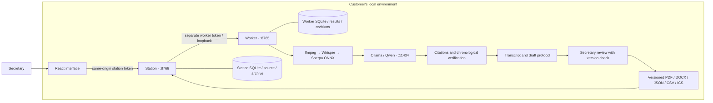
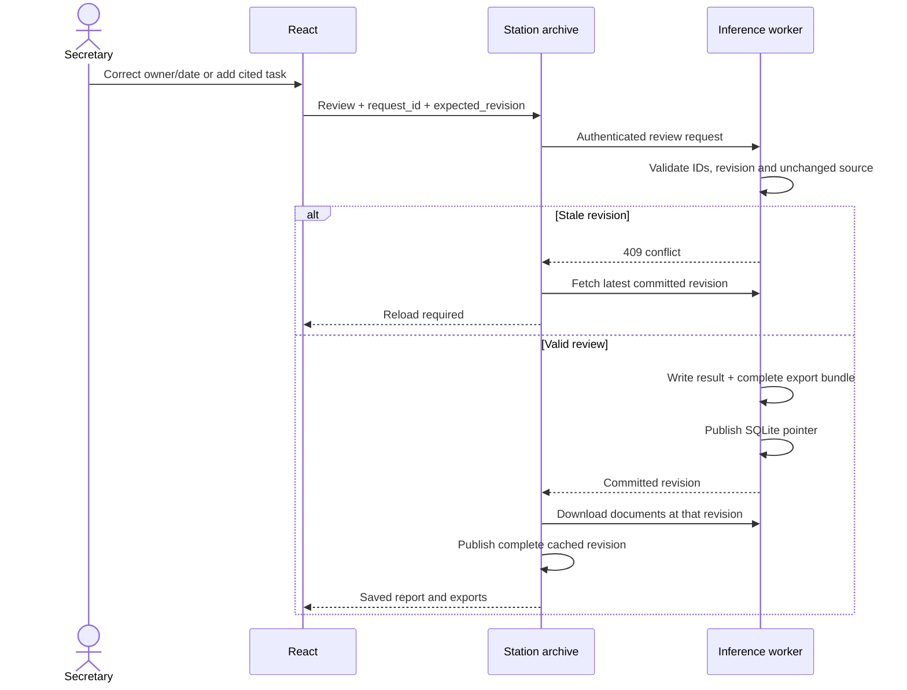

# Meeting Station architecture

The secretary turns a recording into reviewed, traceable assignments. Three
application components own the path: the browser interface, the station archive
API and the local inference worker. Their source is at this repository's root.
The existing module names and API contracts are retained after consolidation.

## Components and boundaries



The standalone application layer uses two Python processes and SQLite/files. `scripts/run-local.py`
starts the existing station and worker; the station serves the built React app.
Ollama runs as a separately provisioned local service. The launcher does not start
Ollama, install anything or download weights. Heavy model jobs
are serialized by the worker. Incomplete jobs retain their sources; interrupted
work can be retried. Standalone hosting binds to loopback and uses a separate
archive/tokens from the historical appliance deployment.

`station/` owns uploaded sources, delivery/retry state and cached reports.
`mac-worker/` owns normalization, inference, evidence checks and export rendering.
`web/frontend/src/features/meeting-intelligence/` owns the user workflow. The
[appliance architecture](APPLIANCE_ARCHITECTURE.md) documents the retained
Radxa/Go/Caddy/browser-capture path, which is not required by local file import.

| Component | Owns | Main entry points |
| --- | --- | --- |
| Browser | Import/record controls, source inspection, review form, revision display, exports | [`MeetingIntelligencePage.tsx`](../web/frontend/src/features/meeting-intelligence/MeetingIntelligencePage.tsx), [`MeetingReviewPanel.tsx`](../web/frontend/src/features/meeting-intelligence/MeetingReviewPanel.tsx) |
| Station | Station-token authorization, source storage, delivery/retry, revision cache | [`local.py`](../station/src/meeting_station/local.py), [`main.py`](../station/src/meeting_station/main.py), [`worker.py`](../station/src/meeting_station/worker.py), [`store.py`](../station/src/meeting_station/store.py) |
| Worker | Model adapters, transcript, findings, evidence, human review and export generation | [`pipeline.py`](../mac-worker/src/meeting_worker/pipeline.py), [`protocol.py`](../mac-worker/src/meeting_worker/protocol.py), [`review.py`](../mac-worker/src/meeting_worker/review.py), [`bundle.py`](../mac-worker/src/meeting_worker/bundle.py) |
| Local launcher | Distinct credentials, loopback services, dependency diagnosis, clean shutdown | [`run-local.py`](../scripts/run-local.py) |

The browser reaches the station at `/api/meeting-worker/`; this retained route
name is a station proxy, not direct access to the worker. The worker token stays
on the station. A separate LAN worker requires mutual TLS. Default ports above
are configurable by the launcher; they are not deployment requirements.

## Repository map

```text
web/frontend/          React/Vite application and browser acceptance
station/               Station API, archive, queue and contract tests
mac-worker/            Local inference, review, exports and contract tests
requirements/          Pinned core Python validation environment
scripts/               Local launch, harness, UI check, source packaging
tests/                 Harness regressions and inherited Go tests
docs/                  Architecture, setup, evidence and case requirements
docs/history/          Inherited Makefile and inactive release/site workflows
.github/workflows/     Current validation workflow
.agents/  .codex/       Project skills and optional agent roles
AGENTS.md              Working agreement
brief.json  state.json Actual case and authorized mode
checks.json            Executable verification commands
```

The retained `cmd/`, `internal/`, `pkg/`, `deploy/`, Go/Docker files, `backend/`,
`engine/`, `macos/` and `web/project-site/` support the earlier appliance, native
client or project website. They are outside the verified standalone path. Their
paths remain intact to avoid breaking those integrations during repository cleanup.
See [historical component map](history/README.md) before changing them.

`.local/` holds private runtime state, installed test browsers and local migration
backups. `.venv/`, `node_modules/`, models, recordings, generated reports and local
Git backups are excluded from commits. The root Git repository is the sole source
repository for the consolidated application and harness.

## Recording and review lifecycle

1. The station authenticates an import, saves the source and queues delivery.
2. The worker normalizes audio, transcribes locally and assigns raw speaker IDs.
3. Structured extraction produces candidate findings; source and chronological
   checks preserve uncertainty when a claim cannot be verified.
4. The secretary names voices, edits or rejects findings, and can recover omitted
   actions by selecting existing transcript passages.
5. The worker renders the complete new document set before publishing its result
   pointer. The station downloads that revision before replacing its cache.



## Human review contract

Authenticated `POST /v1/jobs/{uuid}/review` accepts:

- `request_id`: UUID retained when retrying an uncertain acknowledgement;
- `expected_revision`: revision loaded when editing, starting at zero;
- `reviewer` and `note`: a user-supplied audit label and explanation;
- `speaker_names`: mappings for observed raw speaker IDs only;
- `actions`: existing action IDs with edited task, owner, spoken/calendar
  deadline, priority and explicit human-confirmed / needs-review / rejected status;
- `findings`: explicit status updates for other existing findings;
- `new_actions`: omitted tasks with required existing transcript passage IDs and
  an explicit human-confirmed or needs-review decision. The server assigns IDs
  and derives original quotes, times and speaker data from those passages.

Unknown IDs, duplicate edits, invalid fields and stale revisions are rejected.
An identical request ID/payload is idempotent; reusing an ID with other changes
conflicts. A generated model cannot set human-confirmed review status or supply
trusted speaker names. Naming a speaker does not silently make them the owner
of tasks they mentioned. The secretary explicitly edits the owner.

The worker keeps the initial result and writes each reviewed result to a new
file. It renders and syncs the whole new export directory, then atomically
updates the SQLite result pointer. Readers see a complete previous or next
revision. Review history records before/after fields, request identity, reviewer
label and timestamp. Original transcript words, raw speaker IDs and citation
quotes remain intact; human-assigned names are separate fields. This is an
application audit trail, not cryptographic tamper-proof storage or verified
personal identity.

Edited claims lose the previous automated `source_check`: human confirmation is
represented separately. Summary text is re-derived from accepted findings, so a
rejected action cannot remain in the summary. Rejected actions and actions marked needs-review do not
enter calendar exports; an explicitly human-confirmed correction may do so.
Calendar identities include the job ID and survive task wording changes.

The station downloads files with the expected worker revision, into a separate
revision directory, then updates its cache. A failed download leaves the previous
complete report available. Retry uses the same request ID. If a browser loses
that ID, the next conflict refreshes the committed worker result before the user
reloads. No partially downloaded revision becomes the visible report.

## Trust and practical limits

All model text is data. Quotations, timestamps, speaker IDs/names and review
labels come from trusted transcript fields or explicit human review. The local
semantic verifier receives full chronological context and both deadline fields.
If that context will not fit, or verification fails, claims stay unverified and
the transcript carries a warning. Model judgments can still be wrong or omit
facts. No proof of real-world truth or complete minutes follows from a schema.

Worker HTTP clients ignore environment proxies and redirects. Local Ollama is
required; cloud model metadata is rejected. LAN workers require mutual TLS.
The launcher checks UI build provenance, separate private token files and local
model availability. The current UI uses a shared station token; multi-user roles,
retention/deletion, encrypted disk/backup policy and customer acceptance remain
deployment work. See [REQUIREMENTS.md](REQUIREMENTS.md) and
[SUBMISSION_NOTES.md](SUBMISSION_NOTES.md) for the tested scope.
